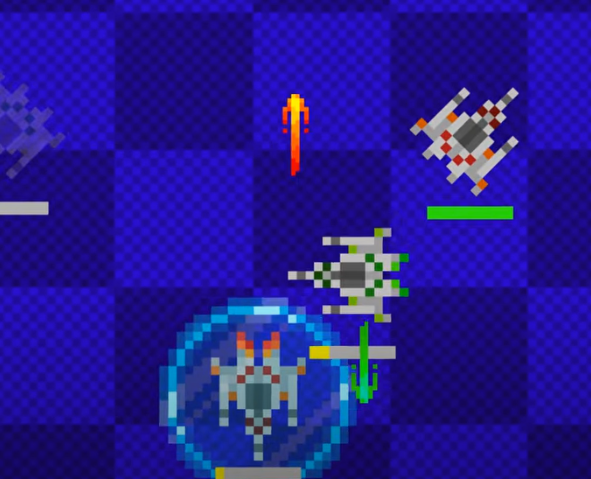

# 1st Annual Makerchip ASIC Design Showdown, 2025

## Team name: 
- VeriFast
## Team members:
- Jacobo Morales Erazo
- Gabriela Villalba
- Juan David Garavito

# Overview

This repository contains the work of the team members listed above, created for participation in the 1st Annual Makerchip ASIC Design Showdown. For Showdown details, see https://www.redwoodeda.com/showdown-info. Additional information and discussion can be found in the `#showdown` channel of the [TL-Verilog User's Slack workspace](https://join.slack.com/t/tl-verilog-users/shared_invite/zt-4fatipnr-dmDgkbzrCe0ZRLOOVm89gA) .

This coding contest revolves around a strategic battle between fleets of three autonomous ships. Each team is tasked with designing the control circuitry that enables their spacecraft to outmaneuver and outsmart opposing fleets through intelligent automation and tactical programming.

## Rules of Combat 

Your three ships can:

- accelerate
- fire up, down, left, or right
- activate a shield
- activate cloaking

Each ship has a recharging energy supply. Each action costs energy. You might take an offensive strategy, firing often; you might take a defensive strategy, leaning heavily on your shields and cloaking; or you might focus on maneuverability. Your strategy is what sets you apart from your competition.

Your ships are able to monitor the positions of the other ships (unless cloaked) and whether they are cloaked. They know which ships have been destroyed (on both teams). They cannot see enemy bullets or shields.

Ships are destroyed when they are shot or when their hit box exits the play area.

Control circuits have inputs characterizing the visible state of the system, and they provide outputs that affect this state on the next cycle. Acceleration is applied as an instantaneous burst that immediately affects velocity, which affects the position on the next cycle. The VIZ tab on a given cycle reflects the state as updated by the inputs on that cycle.

The coordinate system is flipped 180 degrees between the opponents, around (0, 0) in the center, so the starting ship coordinates are the same for both opponents. The X dimension increases to the right, and the Y dimension increases upward.

Ships are numbered 0, 1, 2 and have energy bars colored yellow, green, and blue, respectively. Players/teams are red and green, corresponding to 0 and 1 in the code, and, in VIZ, 1 and 2.

Other game parameters like hit box and board sizes can be found at the top of `showdown_lib.tlv`.

## Walkthrough/Promo Video

## Competition Rules

The Makerchip platform is the judge and jury for battles. The winner of each battle is the player/team who destroys all enemy ships or has the most ships remaining at (roughly) Makerchip's cycle limit of ~600 cycles. Submissions that fail to compile and simulate within Makerchip's timeout will not be able to compete. Battles that fail to compile/simulate will be deemed a tie or awarded to the team that was not responsible for the failure. Details of the tournament structure will be determined close to the competition date, depending upon participation.

Your submission must be based on the latest Verilog or TL-Verilog template and must not reference signals outside of your control circuit and its inputs/outputs. Bug fixes in the templates and Showdown library may be required during the coding period. Rule changes will not be introduced lightly, but may be deemed necessary to facilitate the best experience and would be communicated in Slack. Be sure you are receiving Slack notifications.

Inconsiderate behavior will not be tolerated and may result in disqualification. In the event of disputes, ambiguity, library/template bugs affecting outcomes, disqualification, etc., Redwood EDA, LLC's decisions are final and may result in loss of prize money. Details can be found in the [Showdown Terms and Conditions](https://www.redwoodeda.com/showdown-terms).
